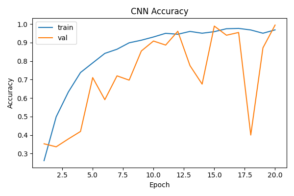

# Static ASL Alphabet Recognition

**CPS843 - Introduction to Computer Vision (Fall 2025)**  
**Author:** Anthony Teti  
**Institution:** Toronto Metropolitan University

A comparative study of classical computer vision and deep learning approaches for American Sign Language (ASL) alphabet recognition using the Sign Language MNIST dataset.

## Project Overview

This project implements and compares two approaches for static ASL alphabet recognition:

1. **Classical Pipeline:** HOG features + PCA dimensionality reduction + Linear SVM
2. **Deep Learning Pipeline:** Convolutional Neural Networks with data augmentation

**Dataset:** Sign Language MNIST (24 classes: A-Y excluding J and Z)
- Training: 27,455 samples (28×28 grayscale)
- Test: 7,172 samples

## Corrected trainer: 20-epoch maximum rerun

The large augmented CNN was retrained after fixing the best-checkpoint snapshot.
This single-seed run used **24,710 training images**, **2,745 validation images**,
and **7,172 test images**. The supplied training and test CSVs share no identical
pixel-row hashes. Validation is an image-level random split, not a verified
signer-disjoint split.

| Setting / result | Value |
|---|---|
| Seed | 42 |
| Input / batch size | 48 × 48 / 128 |
| Optimizer | Adam, learning rate 0.001 |
| Training limit / early-stopping patience | 20 / 5 epochs |
| Completed epochs / selected epoch | 20 / 20 |
| Best validation accuracy | 99.49% |
| Test accuracy | **98.61%** |
| Runtime | CPU, four compute threads, no data-loader workers |

Independent evaluation of the saved checkpoint gave the same test accuracy as
the trainer. This is a rerun of the existing selected configuration, not a new
model-selection study or an estimate of performance on real-world signing.
The historical 31-epoch experiment and this run use different training limits;
their difference cannot be attributed solely to the checkpoint fix.

To repeat after placing the dataset CSVs in `data/raw/sign_mnist/`:

```bash
python src/reproduce_sign_cnn.py
```

The [manifest](results/reproduction/manifest.json) records runtime versions,
dataset and source hashes, and the exact commands. Artifacts include
[split indices](results/reproduction/split_indices.csv),
[training log](results/reproduction/training.log),
[metrics](results/reproduction/large_metrics.json),
[independent evaluation](results/reproduction/cnn_eval_metrics.json), and
[the selected checkpoint](results/reproduction/sign_cnn_large_aug.pt).



## Historical Results

| Model | Test Accuracy | Parameters |
|-------|--------------|------------|
| HOG + PCA(200) + SVM | 83.95% | ~5k |
| Small CNN (no augmentation) | 51.20% | 8.6k |
| Medium CNN (no augmentation) | 56.33% | 30k |
| Large CNN (no augmentation) | 33.56% | 262k |
| Small CNN + augmentation | 41.63% | 8.6k |
| Medium CNN + augmentation | 39.22% | 30k |
| **Large CNN + augmentation** | **96.63%** | 262k |

The large augmented CNN has the highest test accuracy among these recorded
experiments. An independent evaluation of its original committed checkpoint
reproduced **96.63%** on the supplied 7,172-image test set. Its training metadata
records **31 epochs**, so this result should not be presented as the output of
the 20-epoch quick-start command below. The other historical experiments have
not been independently rerun in this audit.

## Repository Structure

```
├── data/raw/sign_mnist/          # Dataset CSVs
├── src/
│   ├── classical/train_hog_svm.py
│   ├── cnn/
│   │   ├── models.py
│   │   ├── train_sign_cnn.py
│   │   └── eval_sign_cnn.py
│   ├── sign_mnist_dataset.py
│   └── utils.py
├── scripts/                       # Plotting utilities
├── results/
│   ├── classical/                 # HOG+SVM outputs
│   ├── checkpoints/               # Trained models
│   └── plots/                     # Training curves
└── requirements.txt
```

## Quick Start

### Setup

```bash
git clone https://github.com/anthonyteti/CPS843-Project.git
cd CPS843-Project

python -m venv .venv
.venv\Scripts\activate              # Windows
# source .venv/bin/activate         # Linux/Mac

pip install -r requirements.txt
```

### Train Classical Model

```bash
python src/classical/train_hog_svm.py \
  --train_csv data/raw/sign_mnist/sign_mnist_train.csv \
  --test_csv data/raw/sign_mnist/sign_mnist_test.csv \
  --pca_dims 20 50 100 200
```

Outputs: `results/classical/hog_svm_metrics.json`, confusion matrix, saved model

### Train CNN

```bash
# Best model: Large CNN with augmentation
python src/cnn/train_sign_cnn.py \
  --variant large \
  --image_size 48 \
  --augment \
  --epochs 20 \
  --checkpoint_path results/checkpoints/sign_cnn_large_aug.pt
```

Outputs: Model checkpoint, training curves, metrics JSON

### Evaluate CNN

```bash
python src/cnn/eval_sign_cnn.py \
  --checkpoint results/checkpoints/sign_cnn_large_aug.pt \
  --image_size 48
```

Outputs: Test accuracy, confusion matrix

## Implementation Details

**Classical Pipeline:**
- HOG: 9 orientation bins, 4×4 pixel cells, L2-Hys normalization
- PCA: Sweep [20, 50, 100, 200] dimensions
- Linear SVM with C=1.0

**CNN Architectures:**
- Small: 2 conv stages (16→32 filters), 8.6k params
- Medium: 2 conv stages (32→64 filters), 30k params
- Large: 3 conv stages (64→128→128 filters), 262k params

**Training Configuration:**
- Input: 48×48 (upscaled from 28×28)
- Optimizer: Adam (lr=1e-3), batch size 128
- Early stopping: patience 5 on validation accuracy
- Augmentation: ±10° rotation, ±10% translation, 0.9-1.1× scaling

## Dependencies

Core libraries: PyTorch, torchvision, scikit-learn, scikit-image, numpy, pandas, matplotlib

See `requirements.txt` for the full dependency list; versions are currently unpinned.

## Reproducing and testing

Download the Sign Language MNIST CSV files from the dataset linked below and place
`sign_mnist_train.csv` and `sign_mnist_test.csv` in `data/raw/sign_mnist/` before
running training or evaluation. Use the same `--image_size` for both commands.

Run the checkpoint regression test from the repository root:

```bash
python -m unittest discover -s tests -v
```

The test runs the actual training orchestration with a tiny model and controlled
validation scores, checking that later epochs cannot overwrite the best weights.
It does not require the dataset. The corrected large augmented model has now been
rerun with the recorded protocol above; the other model configurations remain
historical results.

## Citation

```
@misc{teti2025asl,
  author = {Teti, Anthony},
  title = {Static ASL Alphabet Recognition: Classical vs. Deep Learning},
  year = {2025},
  institution = {Toronto Metropolitan University},
  course = {CPS843 - Introduction to Computer Vision}
}
```

## References

- Sign Language MNIST: https://www.kaggle.com/datasets/datamunge/sign-language-mnist
- HOG Features: Dalal & Triggs, CVPR 2005
- CNNs for Sign Language: Pigou et al., ECCV Workshops 2015

## License

This project is submitted as coursework for CPS843 at Toronto Metropolitan University.
